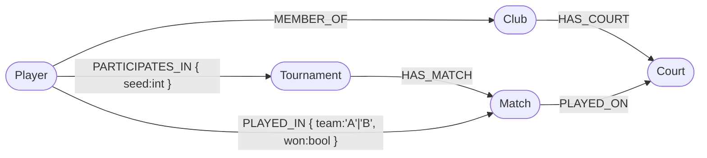

# KN-N-01 — Installation und Datenmodellierung für Neo4j

## A) Installation

Lokale Neo4j-Instanz via Docker (entspricht in Bedienung exakt Neo4j Aura oder einer eigenen AWS-Instanz):

```yaml
neo4j:
  image: neo4j:5
  ports: ["7474:7474", "7687:7687"]
  environment:
    NEO4J_AUTH: neo4j/m165NeoPass
```

Verbindung via Neo4j Browser unter `http://localhost:7474` und Bolt-Treiber via `bolt://localhost:7687`.

Screenshot der erfolgreichen Verbindung: [x_res/neo4j_connected.png](./x_res/neo4j_connected.png).

## B) Logisches Modell

Aufbauend auf demselben konzeptionellen Modell wie für MongoDB (Padel Tournament Tracker — KN-M-02).



### Knoten-Typen und Attribute

| Label | Attribute |
|---|---|
| `Player` | `license_no:int`, `first_name:string`, `last_name:string`, `birthdate:date`, `ranking_points:int`, `gender:string` |
| `Club` | `name:string`, `city:string`, `founded:date` |
| `Court` | `number:int`, `surface:string`, `indoor:bool`, `hourly_rate:float` |
| `Tournament` | `name:string`, `category:string`, `start_date:date`, `prize_money:float` |
| `Match` | `played_at:datetime`, `sets_a:list<int>`, `sets_b:list<int>` (Neo4j unterstützt keine Maps in Listen → zwei parallele Listen statt einer Liste von `{a,b}`) |

### Kanten-Typen und Attribute

| Kante | Quelle → Ziel | Attribute |
|---|---|---|
| `MEMBER_OF` | Player → Club | `since:date` |
| `HAS_COURT` | Club → Court | – |
| `PARTICIPATES_IN` | Player → Tournament | `seed:int`, `registered_at:date` |
| `HAS_MATCH` | Tournament → Match | `round:string` ("R32","QF","SF","F") |
| `PLAYED_ON` | Match → Court | – |
| `PLAYED_IN` | Player → Match | `team:string` ("A"/"B"), `won:bool` |

### Begründung der Attribut-Verteilung

- **`PARTICIPATES_IN.seed`** gehört an die Kante: der Seed eines Spielers ist **turnier-spezifisch** (Carlos kann beim Open Seed #2 sein und beim Spring Cup Seed #5). Würde man `seed` an `Player` legen, könnte man pro Spieler nur einen Wert speichern.
- **`PLAYED_IN.team` und `.won`**: gleiche Logik — derselbe Spieler spielt in verschiedenen Matches als Team A oder B, mit unterschiedlichem Ausgang. Diese Attribute existieren nur **in Bezug auf** ein konkretes Match.
- **`HAS_MATCH.round`**: die Turnier-Runde (R32/QF/SF/F) ist eine Eigenschaft des Matches **innerhalb eines** Turniers. Sie wird hier an die Kante zwischen Turnier und Match gehängt, damit der Match-Knoten selbst frei bleibt für andere Turniere (falls je ein Match in mehreren Turnieren gezählt würde — unwahrscheinlich, aber sauberes Modell).
- **`MEMBER_OF.since`**: Mitgliedschaftsdatum. Wenn ein Spieler den Club wechselt, ändert sich `since` — pro Beziehung speicherbar.
- **Knoten-Attribute** wie `ranking_points` oder `first_name` sind intrinsisch zum Spieler und unabhängig von einer Beziehung — gehören also an den Knoten.

Bild: [x_res/logical_neo4j.png](./x_res/logical_neo4j.png). Original (Mermaid): [x_res/logical_neo4j.mmd](./x_res/logical_neo4j.mmd).
